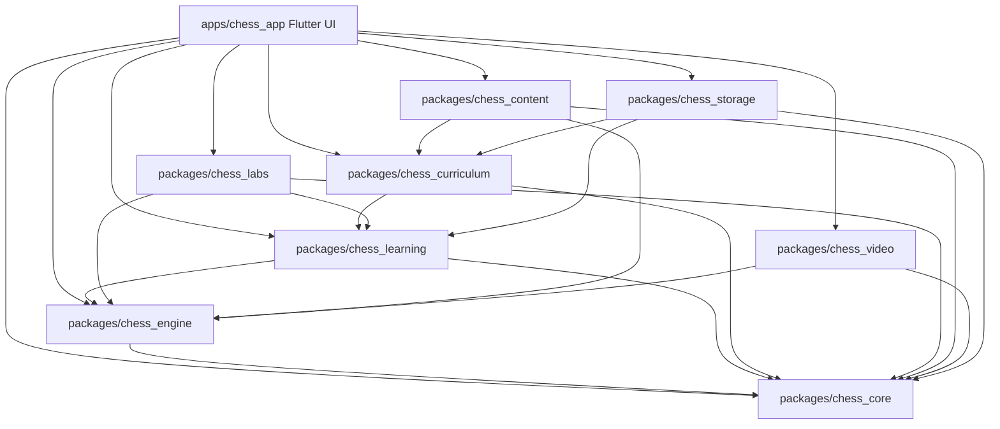

# ChessMaster System Architecture & Forensic Engineering Design

## 1. Architectural Philosophy & Zero-Trust Reliability

ChessMaster is engineered as an **offline-first, zero-telemetry, hermetic multi-platform chess mastery platform**. The architecture adheres to five inviolable principles:
1. **Zero External Runtime Dependencies**: All legal move generation, perft calculations, PGN/FEN transformations, and heuristic evaluations operate entirely in-process without network connectivity.
2. **Deterministic Layered Isolation**: The system is split across 8 modular pure Dart packages and a Flutter application runner (`apps/chess_app`). Low-level chess logic cannot depend on UI or high-level services.
3. **Double-Engine Resilience**: Stockfish UCI is prioritized for deep evaluation. When host platform constraints prevent binary execution (e.g. sandboxed web or missing binaries), the platform transparently switches to the pure-Dart `EmbeddedHeuristicEngine` with zero user disruption.
4. **Closed-Loop Cognitive Mastery**: Mistakes are classified across 11 cognitive blunder archetypes and immediately scheduled into a Leitner spaced-repetition queue with 6-gate mastery criteria.
5. **Local-First Data Ownership**: Learner profiles, game histories, and SRS progression reside exclusively in local storage with atomic writes and full portable JSON backup/restore.

---

## 2. Monorepo Topology & Dependency Graph

---

## 3. Package Responsibilities & Boundaries

### 3.1 `packages/chess_core` (Zero Dependencies)
- **State Representation**: 64-square `Board` model with piece placement, active turn, castling rights, en passant target, halfmove clock, and fullmove count.
- **Move Generation**: `MoveGenerator` generating legal moves only, with strict king-safety checks, pin detection, check evasion, and 50/75-move rules.
- **Algebraic Notations**: Strict `SanParser` and `FenParser` conforming to FIDE standards and malicious payload rejection.
- **PGN Ingestion**: Full game tree parsing with recursive nested variations, headers, annotations, and NAGs.
- **Zobrist Hashing**: 64-bit random state hashing for threefold repetition and transposition caching.
- **Clock Engine**: Dual-timer tournament clock supporting Fischer, Bronstein, and simple delay modes.

### 3.2 `packages/chess_engine` (UCI & In-Memory Fallback)
- **`NativeStockfishEngine`**: Manages headless Stockfish process via bi-directional standard I/O pipes using UCI protocol (`isready`, `ucinewgame`, `position`, `go depth`, `stop`).
- **`EmbeddedHeuristicEngine`**: Pure Dart alpha-beta minimax engine with piece-square tables, pawn structure evaluation, king safety heuristics, and iterative deepening.
- **`RootCauseClassifier`**: 11-category cognitive diagnosis engine attributing blunders to tactical blindspots, calculation fatigue, impulsive play, time pressure, or endgame gaps.

### 3.3 `packages/chess_learning` (SRS & Skill Graph)
- **12-Axis Skill Graph**: Evaluates Tactics, Positional Play, Endgames, Opening Prep, Calculation, Defense, Time Management, Conversion, Pawn Structure, Board Memory, Psychology, and Prophylaxis.
- **6-Gate Mastery Criteria**: A skill node is marked `mastered` only when passing knowledge score ($\ge 0.90$), isolated accuracy ($\ge 0.90$), mixed accuracy ($\ge 0.85$), game application ($\ge 0.80$), 7-day retention ($\ge 0.85$), and 30-day retention ($\ge 0.80$).
- **Leitner Engine**: 5-box spaced repetition scheduling for blunder drills and curriculum review items.

### 3.4 `packages/chess_curriculum` (90-Day GM Curriculum)
- **Curriculum Catalog**: 90 fully authored instructional days organized into 10 structured phases.
- **13 Milestone Exams**: Weekly evaluative exams (Days 7, 14, 21, 28, 35, 42, 49, 56, 63, 70, 77, 84, 90) with an 85% pass threshold.
- **Prerequisite Validation**: DAG of skill requirements preventing learners from jumping into advanced calculation without foundational tactical mastery.

### 3.5 `packages/chess_labs` (16 Interactive Engines)
- **Stateful Controllers**: 16 specialized lab controllers handling hints (-20% score deduction), instant automated engine replies, and no-tactic declarations.

### 3.6 `packages/chess_content` (Curated Data & Mining)
- **Model Games Database**: Curated public-domain games spanning Morphy, Capablanca, Fischer, Kasparov, and Carlsen.
- **Puzzle Miner**: Automated PGN blunder extractor mining tactical puzzles from recorded games using centipawn evaluation swings.
- **ECO Book**: 100+ ECO opening classifications with move sequence trie indexing.

### 3.7 `packages/chess_video` (Video Studio & Timeline)
- **Timeline Generator**: Generates frame-accurate 30/60fps video timelines from PGN games with smooth move interpolation.
- **Real Video Renderer**: Discovers host `ffmpeg` and `ffprobe` binaries to assemble MP4 H.264 video bundles and GIF animations.

### 3.8 `packages/chess_storage` (Atomic Local Persistence)
- **Storage Repository**: Local database abstraction supporting desktop filesystem storage, web browser local storage, and in-memory test harnesses.
- **Atomic File Writing**: Writes database files to temporary targets before atomic rename to prevent corruption upon abrupt shutdown.
- **Full Backup**: Roundtrip JSON export and import for seamless cross-device migration.

### 3.9 `apps/chess_app` (Flutter Presentation Layer)
- **Responsive Layout**: Adapts between Compact Mobile (360x640), Medium Tablet (768x1024), and Expanded Desktop (1920x1080) with NavigationRail and adaptive dialogs.
- **Luxury Theme System**: Curated deep slate (`#0B0F19`) and dark navy palettes with emerald accent highlights and WCAG AAA compliant contrast.
- **Universal Board**: High-performance chess board with SVG/Unicode piece rendering, legal square target highlights, touch/mouse drag-and-drop, and full accessibility Semantics.
