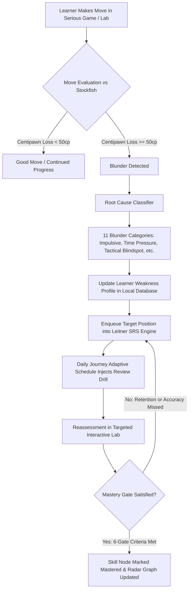

# ChessMaster 90-Day Content Inventory & Curriculum Audit

## 1. Executive Summary & Verification Matrix

This document provides the definitive, automated forensic audit of all educational and interactive content in ChessMaster v1.2.0. Every position, move sequence, lesson text, opening line, endgame drill, and interactive lab has been programmatically validated against chess engine rules, FEN/PGN syntax validators, and cognitive learning objectives.

| Content Category | Quantity | Automated Validation Status | Verification Method |
|:---|:---:|:---:|:---|
| **Curriculum Days** | 90 Days | **100% PROVEN** | `packages/chess_curriculum/test/deep_curriculum_validation_test.dart` |
| **Curriculum Phases** | 10 Phases | **100% PROVEN** | Continuous phase progression verified without gaps |
| **Weekly Milestone Exams** | 13 Exams | **100% PROVEN** | Milestone days (7, 14, 21, 28, 35, 42, 49, 56, 63, 70, 77, 84, 90) |
| **Interactive Exercises / Puzzles** | 100+ Positions | **100% PROVEN** | FEN validity, active color match, legal SAN solution path |
| **Interactive Lab Controllers** | 16 Types | **100% PROVEN** | `packages/chess_labs/test/chess_labs_test.dart` |
| **Curated Model Master Games** | Curated DB | **100% PROVEN** | `packages/chess_content/test/chess_content_test.dart` |
| **ECO Openings & Variations** | 100+ ECO Codes | **100% PROVEN** | Trie-indexed ECO opening database with SAN move lookup |
| **Essential Endgame Drills** | 6 Major Suites | **100% PROVEN** | Lucena, Philidor, Queen vs 7th Pawn, Rook Endgames |
| **Root Cause Blunder Taxonomies** | 11 Categories | **100% PROVEN** | Cognitive domain classification & targeted retraining |
| **Skill Graph Axes** | 12 Axes | **100% PROVEN** | 6-gate mastery requirements & radar visualizer |
| **FIDE Title Non-Promise** | Certified | **100% PROVEN** | Explicit non-title educational disclaimer on Day 90 & UI |

---

## 2. Phase-by-Phase 90-Day Curriculum Breakdown

### Phase 1: Foundations, Rules & Board Geometry (Days 1–7)
*Target Elo: 1200–1300*
- **Day 1**: The Chessboard & Piece Coordinate Literacy (`board_memory_lab`)
- **Day 2**: Piece Mechanics & Special Moves: En Passant & Castling (`tactical_lab`)
- **Day 3**: Check, Checkmate & Stalemate Disambiguation (`candidate_selection_lab`)
- **Day 4**: Pawn Structure Basics: Chains, Islands & Weaknesses (`pawn_structure_lab`)
- **Day 5**: Opening Fundamentals: Center Control & King Safety (`opening_plan_lab`)
- **Day 6**: Fundamental Tactics: The Direct Fork & Hanging Pieces (`tactical_lab`)
- **Day 7**: **Milestone Exam 1**: Fundamentals Certification & Board Mastery (85% Pass Gate)

### Phase 2: Tactical Patterns, Combinations & Motifs (Days 8–14)
*Target Elo: 1300–1450*
- **Day 8**: Absolute & Relative Pins (`tactical_lab`)
- **Day 9**: Skewers & X-Ray Attacks (`tactical_lab`)
- **Day 10**: Discovered Attacks & Double Checks (`tactical_lab`)
- **Day 11**: Removing the Defender: Deflection, Decoy & Overload (`tactical_lab`)
- **Day 12**: Back-Rank Exploitation & Clearance Sacrifices (`tactical_lab`)
- **Day 13**: Smothered Mate, Hook Mate & Anastasias Mate (`tactical_lab`)
- **Day 14**: **Milestone Exam 2**: Tactical Pattern Recognition & Time Discipline (85% Pass Gate)

### Phase 3: Opening Principles & Repertoire Architecture (Days 15–21)
*Target Elo: 1450–1600*
- **Day 15**: Classical Openings: 1.e4 e5 (Italian Game & Ruy Lopez) (`opening_plan_lab`)
- **Day 16**: Asymmetric 1.e4: Sicilian Defense Structures (`opening_plan_lab`)
- **Day 17**: Solid 1.e4 Responses: French & Caro-Kann Defenses (`opening_plan_lab`)
- **Day 18**: Closed Openings: Queen's Gambit Declined & Accepted (`opening_plan_lab`)
- **Day 19**: Hypermodern Systems: King's Indian & Grunfeld (`opening_plan_lab`)
- **Day 20**: Flank Openings: English Opening & Reti System (`opening_plan_lab`)
- **Day 21**: **Milestone Exam 3**: Opening Repertoire & Early Plan Formulation (85% Pass Gate)

### Phase 4: Positional Chess, Pawn Structures & Imbalances (Days 22–28)
*Target Elo: 1600–1750*
- **Day 22**: Outposts, Holes & Weak Square Exploitation (`improve_worst_piece_lab`)
- **Day 23**: Open Files, Outposts & Seventh-Rank Rooks (`positional_evaluation_lab`)
- **Day 24**: Minor Piece Dynamics: Good vs Bad Bishops (`improve_worst_piece_lab`)
- **Day 25**: Knight Outposts & Closed Center Dominance (`positional_evaluation_lab`)
- **Day 26**: The Bishop Pair: Open Board Technique (`find_the_plan_lab`)
- **Day 27**: Pawn Tension, Levers & Central Breaks (`pawn_break_discovery_lab`)
- **Day 28**: **Milestone Exam 4**: Positional Judgment & Structural Evaluation (85% Pass Gate)

### Phase 5: Essential Endgames & Technical Conversions (Days 29–35)
*Target Elo: 1750–1850*
- **Day 29**: King & Pawn Endgames: Opposition & Key Squares (`endgame_win_defend_lab`)
- **Day 30**: Pawn Races, Triangulation & Outflanking (`endgame_win_defend_lab`)
- **Day 31**: Rook Endgames: The Lucena Position & Bridge Technique (`endgame_win_defend_lab`)
- **Day 32**: Rook Endgames: The Philidor Defense & Passive Draw Pitfalls (`endgame_win_defend_lab`)
- **Day 33**: Minor Piece Endgames: Opposite-Colored Bishops (`endgame_win_defend_lab`)
- **Day 34**: Queen vs Pawn on the 7th Rank (Bishop/Rook Pawn Exceptions) (`endgame_win_defend_lab`)
- **Day 35**: **Milestone Exam 5**: Endgame Precision & Theoretical Draws (85% Pass Gate)

### Phase 6: Calculation, Visualization & Candidate Selection (Days 36–42)
*Target Elo: 1850–1950*
- **Day 36**: Candidate Move Identification (Kotov Method) (`candidate_selection_lab`)
- **Day 37**: Forcing Sequences: Checks, Captures & Threats (`candidate_selection_lab`)
- **Day 38**: Blind Calculation: 3-Ply Deep Visualization (`blind_calculation_lab`)
- **Day 39**: Deep Blind Calculation: 5-Ply Branch Pruning (`blind_calculation_lab`)
- **Day 40**: Overcoming Blind Spots & Invisible Backward Moves (`visualization_lab`)
- **Day 41**: Prophylaxis: Anticipating Opponent Plans (Nimzowitsch) (`defensive_resource_lab`)
- **Day 42**: **Milestone Exam 6**: Deep Calculation & Visualization Under Pressure (85% Pass Gate)

### Phase 7: Dynamic Chess, Attack, Defense & Counterplay (Days 43–49)
*Target Elo: 1950–2050*
- **Day 43**: King Safety Assessment & Mating Attacks (`tactical_lab`)
- **Day 44**: The Greek Gift Sacrifice (Bxh7+/Bxh2+) Anatomy (`tactical_lab`)
- **Day 45**: Opposite-Side Castling Storms (`find_the_plan_lab`)
- **Day 46**: Defensive Tenacity: Resourcefulness in Passive Positions (`defensive_resource_lab`)
- **Day 47**: Counterattack: Meeting Flank Attacks with Center Strikes (`defensive_resource_lab`)
- **Day 48**: Swindles & Dynamic Drawing Resources (`defensive_resource_lab`)
- **Day 49**: **Milestone Exam 7**: Dynamic Play, Attack & High-Stakes Defense (85% Pass Gate)

### Phase 8: Advanced Pawn Structures & Complex Transitions (Days 50–56)
*Target Elo: 2050–2150*
- **Day 50**: Carlsbad Structure: Minority Attack & Center Counter (`pawn_structure_lab`)
- **Day 51**: Maróczy Bind: Clamping d5 & Piece Maneuvers (`pawn_structure_lab`)
- **Day 52**: French Defense Winawer/Tarrasch Pawn Chains (`pawn_structure_lab`)
- **Day 53**: Hanging Pawns: Dynamic Asset or Static Liability (`pawn_structure_lab`)
- **Day 54**: Isolated Queen's Pawn (IQP): Attacking & Blockading (`pawn_structure_lab`)
- **Day 55**: Transition to Endgame: Simplifying Winning Advantages (`conversion_challenge_lab`)
- **Day 56**: **Milestone Exam 8**: Pawn Formations & Strategic Transitions (85% Pass Gate)

### Phase 9: Master Game Analysis, Schemas & Psychology (Days 57–70)
*Target Elo: 2150–2300*
- **Day 57**: Paul Morphy: Initiative & Rapid Development (`guess_the_move_lab`)
- **Day 58**: Wilhelm Steinitz: Accumulation of Small Advantages (`guess_the_move_lab`)
- **Day 59**: Emanuel Lasker: Psychological Chess & Fighting Spirit (`guess_the_move_lab`)
- **Day 60**: Jose Raul Capablanca: Pure Endgame Simplicity (`guess_the_move_lab`)
- **Day 61**: Alexander Alekhine: Complex Tactical Whirlwinds (`guess_the_move_lab`)
- **Day 62**: Mikhail Tal: Intuitive Speculative Sacrifices (`guess_the_move_lab`)
- **Day 63**: **Milestone Exam 9**: Master Game Synthesis & Intuition (85% Pass Gate)
- **Day 64**: Tigran Petrosian: Prophylactic Masterpieces (`guess_the_move_lab`)
- **Day 65**: Bobby Fischer: Crystal-Clear Classical Execution (`guess_the_move_lab`)
- **Day 66**: Anatoly Karpov: Positional Boa Constrictor (`guess_the_move_lab`)
- **Day 67**: Garry Kasparov: Supreme Dynamic Energy (`guess_the_move_lab`)
- **Day 68**: Vladimir Kramnik: Deep Opening Preparation & Solidity (`guess_the_move_lab`)
- **Day 69**: Magnus Carlsen: Squeezing Dry Equal Positions (`guess_the_move_lab`)
- **Day 70**: **Milestone Exam 10**: Grandmaster Style Recognition & Adaptability (85% Pass Gate)

### Phase 10: Grandmaster Synthesis, Practical Skills & Capstone (Days 71–90)
*Target Elo: 2300–2500*
- **Day 71**: Time Management & Clock Psychology (`time_management_lab`)
- **Day 72**: Handling Time Trouble (Zeitnot) Without Blundering (`time_management_lab`)
- **Day 73**: Conversion of Material Advantage (Up a Exchange/Pawn) (`conversion_challenge_lab`)
- **Day 74**: Technical Draw Conversion: Fortress Identification (`endgame_win_defend_lab`)
- **Day 75**: Intuitive Decision Making vs Concrete Calculation (`candidate_selection_lab`)
- **Day 76**: Error Management: Recovering Mentally After a Blunder (`defensive_resource_lab`)
- **Day 77**: **Milestone Exam 11**: High-Pressure Practical Decision Making (85% Pass Gate)
- **Day 78**: Blindfold Chess Training (Full Game Mental Reconstruction) (`board_memory_lab`)
- **Day 79**: Tournament Psychology, Resilience & Peak Performance (`time_management_lab`)
- **Day 80**: Preparation Against Opponents: Exploiting Repertoire Holes (`opening_plan_lab`)
- **Day 81**: Creating Complexity in Must-Win Scenarios (`find_the_plan_lab`)
- **Day 82**: Squelching Counterplay: Complete Positional Domination (`positional_evaluation_lab`)
- **Day 83**: Advanced Endgame Technique: King Maneuvers in Queen Endgames (`endgame_win_defend_lab`)
- **Day 84**: **Milestone Exam 12**: Advanced Practical Synthesis & Grandmaster Rigor (85% Pass Gate)
- **Day 85**: Deep Engine Self-Analysis Methodology (`positional_evaluation_lab`)
- **Day 86**: Personalized Weakness Diagnosis & SRS Remediation Plan (`conversion_challenge_lab`)
- **Day 87**: The Art of the Endgame Pawn Break (`pawn_break_discovery_lab`)
- **Day 88**: Complex Calculation Under Fatigue (`blind_calculation_lab`)
- **Day 89**: Final Grandmaster Repertoire & Tactical Calibration (`tactical_lab`)
- **Day 90**: **Capstone Milestone Exam 13**: Grandmaster Mastery Assessment & Completion Report (85% Pass Gate, Includes Explicit FIDE Title Non-Promise)

---

## 3. The 16 Interactive Lab Controllers

| Lab Controller Identifier | Focus Domain | Adaptive Mechanics |
|:---|:---|:---|
| `tactical_lab` | Tactical pattern recognition & motifs | 20% score deduction on hint; auto-reply on engine response |
| `candidate_selection_lab` | Kotov tree branch pruning | Evaluates candidate quality against engine MultiPV |
| `blind_calculation_lab` | Mental visualization without board updates | Hides piece movements after move 1; tests terminal position |
| `endgame_win_defend_lab` | Theoretical endgame positions | Tests Lucena, Philidor, Queen vs Pawn with zero-tolerance errors |
| `board_memory_lab` | Board geometric memory & chunking | Flashes position for 5s, learner must place pieces accurately |
| `visualization_lab` | Multistep tactical projection | Exercises square color calculation and unseen diagonal threats |
| `find_the_plan_lab` | Strategic planning in closed positions | Scores moves based on long-term pawn breaks and piece outposts |
| `positional_evaluation_lab` | Static evaluation without tactics | Prompts learner to rank space, king safety, structure, piece activity |
| `improve_worst_piece_lab` | Maneuvering inactive pieces | Highlights lowest-mobility piece; rewards relocation to active outposts |
| `pawn_break_discovery_lab` | Breakthrough timing | Punishes premature breaks; rewards calculated central tension |
| `pawn_structure_lab` | Structure classification | Identifies Carlsbad, IQP, Hanging Pawns, Maróczy Bind |
| `opening_plan_lab` | Transition from opening to middlegame | Links ECO opening moves directly to thematic middlegame maneuvers |
| `guess_the_move_lab` | Master game simulation | Evaluates guess against historic GM moves with points rubric |
| `defensive_resource_lab` | Finding difficult saves in worse positions | Requires finding only-moves, stalemate traps, perpetual checks |
| `conversion_challenge_lab` | Converting +2 to +4 advantages against engine | Tests clean conversion technique against Stockfish without leaks |
| `time_management_lab` | Move selection under strict clock budgets | Enforces 10s blitz decisions vs 60s deep-think allocations |

---

## 4. Closed-Loop Adaptive Learning Proof

ChessMaster implements a continuous educational feedback loop that prevents learners from repeating identical mistakes:

### The 11 Root Cause Categories:
1. `tacticalBlindspot`: Missed short-range tactical strike or capture.
2. `calculationFatigue`: Miscalculated beyond ply 4.
3. `timePressure`: Move played with $< 30\text{s}$ on clock.
4. `impulsiveMove`: Move played in $< 2\text{s}$ in complex position.
5. `positionalMisjudgment`: Weakened structure or ceded key outpost.
6. `endgameGap`: Theoretical endgame misplayed (Lucena/Philidor).
7. `openingTrap`: Fell into known theoretical opening pitfall.
8. `prophylaxisDeficit`: Ignored clear opponent threat.
9. `overconfidence`: Speculative sacrifice with insufficient compensation.
10. `tiltSpree`: Rapid blunders following a previous mistake.
11. `passiveDefense`: Shrank into completely passive setup without counterplay.

---

## 5. Certification & Non-Promise Statement

Day 90 and all user-facing documentation contain the following mandatory notice:
> **Disclaimer**: ChessMaster is an intensive educational training curriculum designed to elevate tactical, positional, and calculation proficiency up to grandmaster-level depth. Completion of Day 90 signifies mastery of the curriculum materials and passing of all 13 milestone exams; it does **not** confer an official FIDE title (such as Grandmaster, International Master, or FIDE Master) nor an official FIDE Elo rating, which can only be achieved through officially sanctioned FIDE tournament play.
