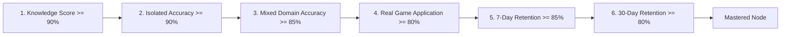

# ChessMaster Learning Design & Pedagogical Engineering

## 1. Pedagogical Foundation

ChessMaster's instructional architecture synthesizes cognitive psychology, chess grandmaster pattern recognition (de Groot & Chase/Simon), and modern deliberate practice methodologies (Anders Ericsson). Rather than passive puzzle solving, the platform enforces active recall, structured candidate move selection, and root-cause analysis of mistakes.

```
Cognitive Model:
[Board Perception] ──> [Pattern Chunking] ──> [Candidate Identification] ──> [Tree Calculation] ──> [Decision Execution]
         ▲                                                                                                  │
         └─────────────────────── [Closed-Loop Remediation Cycle] ◄─────────────────────────────────────────┘
```

---

## 2. The 12 Dimensions of Chess Mastery

Chess competence is modeled across a 12-dimensional skill space rather than a single monolithic rating number:

| Skill Axis | Cognitive Focus | Key Lab Drills | Mastery Threshold |
|:---|:---|:---|:---:|
| **1. Tactics & Combinations** | Automatic pattern recognition of forks, pins, skewers, deflections, back-rank mates. | `tactical_lab` | 90% |
| **2. Positional Strategy** | Imbalances, weak squares, outposts, pawn levers, open files, piece mobility. | `positional_evaluation_lab`, `find_the_plan_lab` | 85% |
| **3. Essential Endgames** | Theoretical precision: Lucena bridge, Philidor defense, Queen vs 7th pawn, opposition. | `endgame_win_defend_lab` | 95% |
| **4. Opening Architecture** | Repertoire knowledge, pawn structure transitions, pawn lever timing. | `opening_plan_lab` | 85% |
| **5. Deep Calculation** | Kotov tree calculation, branch pruning, checks/captures/threats, candidate search. | `candidate_selection_lab`, `blind_calculation_lab` | 85% |
| **6. Defensive Tenacity** | Finding difficult saves, swindles, perpetual check traps, active resourcefulness. | `defensive_resource_lab` | 80% |
| **7. Time Management** | Allocating clock budgets proportionally to position criticality; avoiding zeitnot blunders. | `time_management_lab` | 85% |
| **8. Advantage Conversion** | Converting +2 to +4 material advantages against engine defense without simplification errors. | `conversion_challenge_lab` | 90% |
| **9. Pawn Structures** | Carlsbad minority attack, IQP blockade, Maróczy bind clamp, hanging pawns. | `pawn_structure_lab`, `pawn_break_discovery_lab` | 85% |
| **10. Board Memory & Geometry** | Visualizing unseen coordinates, color complexes, diagonal intersections, blindfold calculation. | `board_memory_lab`, `visualization_lab` | 85% |
| **11. Practical Psychology** | Managing blunder recovery, tournament fatigue, emotional tilt, time-trouble calm. | `time_management_lab`, `guess_the_move_lab` | 80% |
| **12. Prophylaxis & Anticipation**| Nimzowitsch prophylaxis: detecting and neutralizing opponent plans before execution. | `defensive_resource_lab`, `positional_evaluation_lab` | 85% |

---

## 3. The 6-Gate Mastery Model

A skill node is never marked `mastered` simply because an exercise was solved once. ChessMaster enforces a rigorous 6-gate mastery verification:



1. **Gate 1 (Knowledge Score $\ge 0.90$)**: Learner demonstrates thorough theoretical comprehension of concepts in curriculum lesson texts and quizzes.
2. **Gate 2 (Isolated Accuracy $\ge 0.90$)**: High solve accuracy in dedicated, motif-specific drill sets.
3. **Gate 3 (Mixed Domain Accuracy $\ge 0.85$)**: Solving exercises when the theme is unknown in advance (preventing bias).
4. **Gate 4 (Real Game Application $\ge 0.80$)**: Correct execution of the motif or principle in live serious games.
5. **Gate 5 (7-Day Spaced Retention $\ge 0.85$)**: Successfully recalling the motif after a 7-day interval in the Leitner SRS engine.
6. **Gate 6 (30-Day Long-Term Retention $\ge 0.80$)**: Sustained proficiency after a full 30-day spaced interval.

---

## 4. Closed-Loop Adaptive Remediation

When a learner makes an inaccuracy, mistake, or blunder in serious play or labs:
1. **Engine Blunder Detection**: The move is evaluated against Stockfish evaluation swing.
2. **Root Cause Diagnosis**: `RootCauseClassifier` analyzes the clock state, move speed, position phase, and tactics to assign one of 11 root causes.
3. **Weakness Profile Update**: The learner's local database profile updates weakness counters and recalibrates radar dimensions.
4. **SRS Enqueueing**: The exact position and pedagogical solution are enqueued in Box 1 of the Leitner spaced repetition engine.
5. **Daily Journey Injection**: The next daily training session automatically incorporates a targeted review drill tailored to that weakness.
6. **Reassessment & Mastery Verification**: Once the learner demonstrates repeated accuracy and passes 7-day/30-day retention gates, the skill node transitions to `mastered`.

### 4.1 Adaptive Learner Personas & Material Differentiation

ChessMaster tests and validates four distinct learner personas who receive materially different daily training schedules:

1. **Persona 1: The Beginner (~1000–1200 Elo)**
   - *Profile*: Low scores across board vision, basic coordinates, and simple tactical motifs.
   - *Plan Differentiation*: Schedules fundamental tactical pattern recognition, coordinate exercises, and basic two-ply candidate selection drills.
2. **Persona 2: The Intermediate Club Player (~1400–1600 Elo)**
   - *Profile*: Strong tactical intuition, but weak in theoretical endgames (Lucena, Philidor) and pawn structure dynamics (Carlsbad, IQP).
   - *Plan Differentiation*: Reallocates time budgets from basic tactics to deep endgame conversion challenges and pawn structure transformation labs.
3. **Persona 3: The Advanced Player (~1900–2100 Elo)**
   - *Profile*: High theoretical mastery, but suffers catastrophic tactical blunders under severe time pressure (<30 seconds).
   - *Plan Differentiation*: Schedules high-intensity time pressure blitz labs, critical moment detection, and candidate pruning drills.
4. **Persona 4: The Asymmetric-Weakness Player (~1600–1800 Elo)**
   - *Profile*: Lethal king attack (>90% accuracy) combined with brittle, passive defensive tenacity (<30% accuracy).
   - *Plan Differentiation*: Injects intensive defensive resourcefulness labs, fortress construction, and perpetual check swindle drills.

---

## 5. Educational Integrity & Non-Promise Statement

ChessMaster provides structured grandmaster-level chess instruction for personal improvement. 
Completion of the 90-day curriculum:
- Does **not** confer any official FIDE title (Grandmaster, International Master, FIDE Master, Candidate Master).
- Does **not** issue official FIDE Elo ratings.
- Reflects internal mastery of the comprehensive curriculum syllabus and 13 milestone exams.
